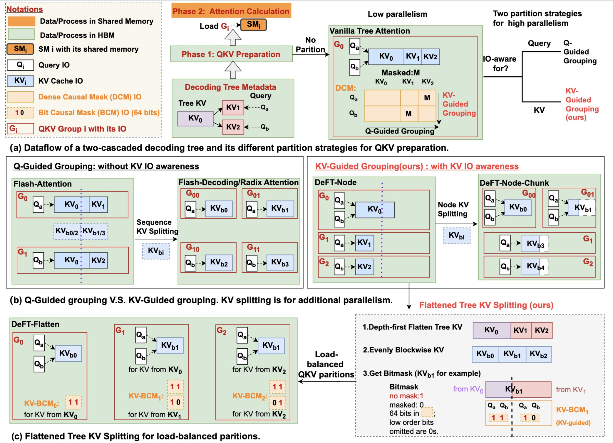
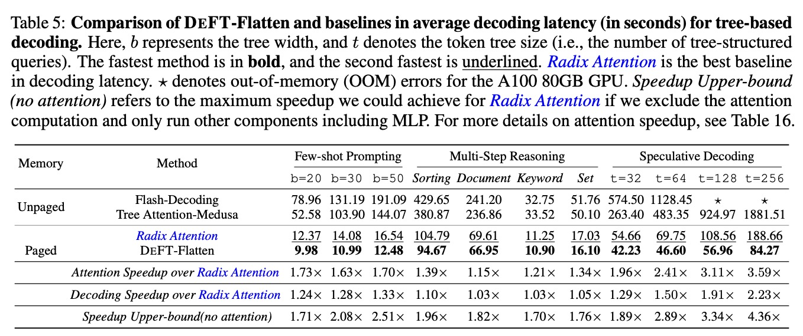
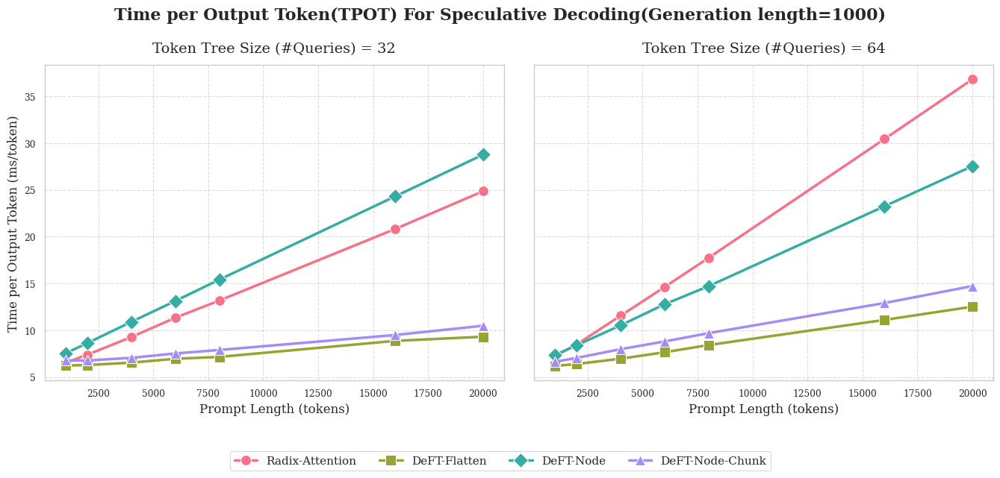
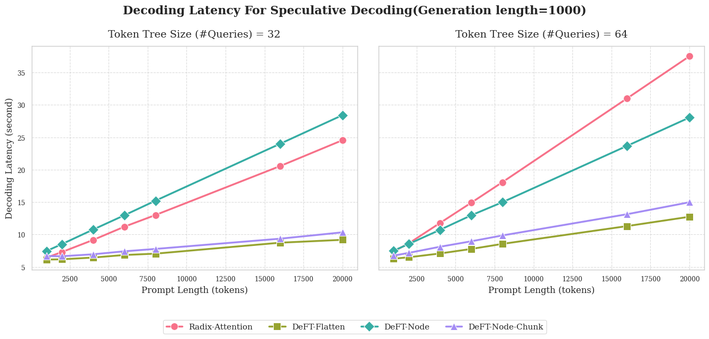
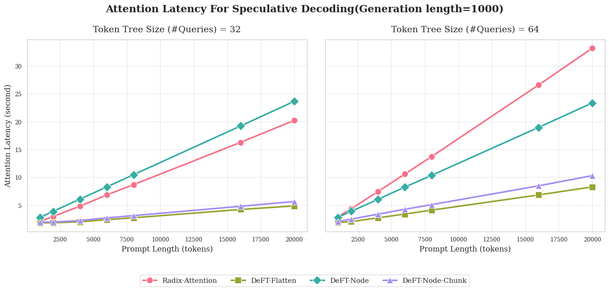

<div align="center">
</img>
</div>
<a href="https://deepwiki.com/LINs-lab/DeFT"></a>

--------------------------------------------------------------------------------

# DeFT: Decoding with Flash Tree-attention for Efficient Tree-structured LLM Inference

<!-- [[paper](https://arxiv.org/abs/2404.00242)] [[slides](placeholder)][[video](placeholder)] -->

<!--  -->


<!-- [Placeholder for video link] -->

## TL;DR
We propose DeFT, an IO-aware attention algorithm for efficient tree-structured interactions with LLMs by optimizing QKV grouping and attention calculation.

[<a href="https://openreview.net/forum?id=2c7pfOqu9k">OpenReview</a>]|[<a href="https://arxiv.org/abs/2404.00242">Arxiv</a>]｜[<a href="/assets/DeFT_ICLR_25_poster.pdf">Poster</a>]
</div>
<br>

<div align="center">
</img>
</div>

## Abstract
Large language models (LLMs) are increasingly employed for complex tasks that process multiple generation calls in a tree structure with shared prefixes of tokens, including few-shot prompting, multi-step reasoning, speculative decoding, etc. However, existing inference systems for tree-based applications are inefficient due to improper partitioning of queries and KV cache during attention calculation.This leads to two main issues: (1) a lack of memory access (IO) reuse for KV cache of shared prefixes, and (2) poor load balancing. As a result, there is redundant KV cache IO between GPU global memory and shared memory, along with low GPU utilization. To address these challenges, we propose DeFT(Decoding with Flash Tree-Attention), a hardware-efficient attention algorithm with prefix-aware and load-balanced KV cache partitions. DeFT reduces the number of read/write operations of KV cache during attention calculation through KV-Guided Grouping, a method that avoids repeatedly loading KV cache of shared prefixes in attention computation. Additionally, we propose Flattened Tree KV Splitting, a mechanism that ensures even distribution of the KV cache across partitions with little computation redundancy, enhancing GPU utilization during attention computations. By reducing 73-99% KV cache IO and nearly 100% IO for partial results during attention calculation, DeFT achieves up to 2.23/3.59X
 speedup in the end-to-end/attention latency across three practical tree-based workloads compared to state-of-the-art attention algorithms.

## *Latest News🔥*
- [2025/3] Codebase of DeFT is released!
- [2025/1] 🎉 DeFT was accepted by [ICLR'25](https://openreview.net/forum?id=2c7pfOqu9k) as Spotlight!
- [2024/3] 🎉 DeFT was accepted by [ICLR'24 AGI Workshop](https://openreview.net/forum?id=HqfLHoX8bR) as Oral!
---
## Contents
- [DeFT: Decoding with Flash Tree-attention for Efficient Tree-structured LLM Inference](#deft-decoding-with-flash-tree-attention-for-efficient-tree-structured-llm-inference)
  - [TL;DR](#tldr)
  - [Abstract](#abstract)
  - [*Latest News🔥*](#latest-news)
  - [Contents](#contents)
  - [Folder Structure](#folder-structure)
    - [`/DeFT`](#deft)
    - [`/dataset/generation`](#datasetgeneration)
  - [Usage](#usage)
      - [Environment Setup](#environment-setup)
      - [Run demos for quick start](#run-demos-for-quick-start)
        - [**Supported Methods**](#supported-methods)
        - [**Table: Attention Operators and Memory Management**](#table-attention-operators-and-memory-management)
      - [Run experiments for large scale tests](#run-experiments-for-large-scale-tests)
      - [**Note on Potential Output Issues**](#note-on-potential-output-issues)
  - [Results](#results)
      - [Performance metrics](#performance-metrics)
      - [Results in the paper](#results-in-the-paper)
        - [**Table: Prompt length and generation length in DeFT paper**](#table-prompt-length-and-generation-length-in-deft-paper)
      - [Additional results](#additional-results)
  - [Roadmaps](#roadmaps)
      - [Efficiency](#efficiency)
      - [Functionality](#functionality)
  - [Citation](#citation)
  - [Acknowledgement](#acknowledgement)

## Folder Structure

### `/DeFT`
This folder contains the implementation of the DeFT codebase along with experiment scripts. For detailed  documentation of arguments, refer to: [`/DeFT/DeFT_Readme.md`](./DeFT/DeFT_Readme.md)


### `/dataset/generation`
This directory houses tree templates for **Reasoning** and **Speculative Decoding** tasks. For additional details about the templates and usage, refer to:

[`/dataset/generation/TreeTemplate_readme.md`](./dataset/generation/TreeTemplate_readme.md)

## Usage

#### Environment Setup
We suggest using `UV` for fast package management.

```bash
conda create -n deft python=3.12
conda activate deft
pip install uv
cd DeFT
uv sync --dev
. .venv/bin/activate # choose your own bash

```

#### Run demos for quick start

- **`DeFT/examples/run_DeFT_llama_paged.py`**: Script to run LLaMA models with DeFT, supporting paged memory management.

Different combinations of `--mode` and `--mem` in `run_DeFT_llama_paged.py` correspond to different baselines and DeFT variants. Refer to [Table: Attention Operators and Memory Management](#table-attention-operators-and-memory-management) for more details about supported combinations.
##### **Supported Methods**
- **Baselines:**
  - **Flash-Decoding**: Sequential attention with unpaged memory.
  - **Tree Attention Medusa**: Tree-structured attention with unpaged memory.
  - **Radix Attention**: Sequential attention with paged memory.
- **DeFT Variants:**
  - **DeFT-Node**: Node-based attention with paged memory.
  - **DeFT-Node-Chunk**: Chunked node-based attention with paged memory.
  - **DeFT-Flatten**: Flattened attention with paged memory.
  - **DeFT-Tree-Index**: (WIP)DeFT-Node attention with paged memory in a tree-indexed manner. It constructs metadata with TreeIndexPool, leveraging node indices for efficient memory access.
##### **Table: Attention Operators and Memory Management**
| Mode           | Memory Management | Method                  |
|----------------|-------------------|-------------------------|
| `seq`          | `unpaged`         | Flash-Decoding          |
| `tree`         | `unpaged`         | Tree Attention Medusa   |
| `seq`          | `paged`           | Radix Attention         |
| `flatten`      | `paged`           | DeFT-Flatten            |
| `node`         | `paged`           | DeFT-Node               |
| `node_chunk`   | `paged`           | DeFT-Node-Chunk         |
| `tree_index`   | `paged`           | DeFT-Tree-Index         |


See [`/DeFT/DeFT_Readme.md`](./DeFT/DeFT_Readme.md) for details of more examples including few-shot prompting, multi-step reasoning and speculative decoding.

```bash
export CUDA_VISIBLE_DEVICES=2 # chose your own GPUs
# export model="meta-llama/Meta-Llama-3-8B" # support llama models
export model="meta-llama/Meta-Llama-3.1-8B" # support llama models
export mode="flatten" # DeFT-Flatten. "seq" for Radix Attention if mem is "paged"
# export mode="seq" # for Radix Attention if mem is "paged"
export mem="paged" # "paged":paged memory management
```


Example for Speculative Decoding:
```bash
export task="Speculative_Decoding"
export dataset="../dataset/generation/Speculative_Decoding/APPS_tree_size64.json" # select tree size =64 tokens for token candidates
export prompt_len=6000 # set the prompt_len(if > original prompt len, we will pad it)
export maxseq=7000
export tree_idx=0 # only select the first tree
python examples/run_DeFT_llama_paged.py --model $model --max_seq_len $maxseq  --mode $mode --Branch_controller $task --dataset $dataset --mem $mem --tree_idx $tree_idx --prompt_len $prompt_len
```

Example for Multi-step Reasoning:
```bash
export task="Practical_Tree"
export workload="sorting128ToT" #("docmergeToT" "sorting128ToT" "set128ToT" "keywordToT")
export dataset="../dataset/generation/Reasoning/$workload.json" # select tree size =128 tokens for token candidates
export tree_idx=0 # only select the first tree
export prompt_len=4000 # pad the prompt to 4000, if you want to adopt original prompt len, don't export it.
export maxseq=7000 # set it to prompt_len+3000(for generated tokens)
python examples/run_DeFT_llama_paged.py --model $model --max_seq_len $maxseq  --mode $mode --Branch_controller $task --dataset $dataset --mem $mem --tree_idx $tree_idx --prompt_len $prompt_len
```

Example for Few-shot Prompting:
```bash
export task="Simple_Tree"
export prompt_len=4000 # pad the prompt to 4000
export maxseq=4400
export width=50 #set tree width to 50
python examples/run_DeFT_llama_paged.py --model $model --max_seq_len $maxseq  --mode $mode --Branch_controller $task --dataset $dataset --mem $mem --prompt_len $prompt_len --max_width $width
```

.
#### Run experiments for large scale tests
```bash
cd DeFT/experiments
```
`DeFT/experiments` contains scripts and results for various experimental setups:
1. **`/ablation`(old and might be out of date)**:
   Ablation studies exploring the effects of different GPUs, models, and prompt lengths on speedups.
2. **`/few_shot_prompting`**:
   [Scripts](/DeFT/experiments/few_shot_prompting/run_few_shot.sh) and [results](/DeFT/experiments/few_shot_prompting/few_shot.ipynb) for few-shot prompting experiments.
   ```bash
   cd few_shot_prompting
   bash run_few_shot.sh [your_device_id]
   ```
3. **`/reasoning`**:
   [Scripts](/DeFT/experiments/reasoning/run_reasoning.sh) and [results](/DeFT/experiments/reasoning/reasoning.ipynb) for multi-step reasoning tasks.
   ```bash
   cd reasoning
   bash run_reasoning.sh [your_device_id]
   ```
4. **`/speculative_decoding`**:
   [Scripts](/DeFT/experiments/speculative_decoding/run_speculative_decoding.sh) and [results](/DeFT/experiments/speculative_decoding/speculative_decoding.ipynb) for speculative decoding experiments.
   ```bash
   cd speculative_decoding
   bash run_speculative_decoding.sh [your_device_id]
   ```
> [!Tip]
> To help you reproduce the results better:
> We provide the reference data in `experiments/[task_name]/[model_name]/ref_data/`, and a notebook to process the data in `experiments/[task_name]/[task_name].ipynb`.
> For example, you can refer to [`speculative_decoding.ipynb`](/DeFT/experiments/speculative_decoding/speculative_decoding.ipynb) for data processing.

#### **Note on Potential Output Issues**

For certain settings, the output might consist of random or unmeaningful words. Below are two specific scenarios to be aware of:

1. **When setting `--prompt_len` longer than the actual prompt length:**
   - If the provided prompt length is shorter than the value set by `--prompt_len`, the prompt will be padded to meet the specified length. However, the additional content may result in unmeaningful output.
   - **Example**:
     When the task is set to `Simple_Tree`, with `--prompt_len` set to `4000` and `--max_seq_len` set to `4400`, the prompt will be padded to `4000` tokens, and the model will generate exactly `400` tokens. The generated content may lack coherence.

2. **When using `Speculative_Decoding`:**
   - This task is a mocked version designed to verify token handling. Token candidates are selected from the top-k logits, which means the output does not carry meaningful content.

---
## Results
#### Performance metrics
We list part of the performance metrics as follows. For a full list of metrics, see [PerfMetrics](/DeFT/deft/tree_decoding/perf_metrics.py), which includes iteration latency, memory management latency, time to first token(TTFT), etc. For end-to-end latency, DeFT's still have 15% framework-induced overheads for tree search, branching, etc. We can reduce this by adopting radix cache in [SGLang](https://docs.sglang.ai/), as listed in the [roadmaps](#roadmaps).
- **Decoding latency**: essentially represents the ***optimal end-to-end (e2e) latency***, excluding other overheads such as prefill latency (which accounts for approximately 5-10% of e2e latency) and framework-induced overheads (roughly 10-15% of e2e latency), including tree search, branching, etc. We exclude these overheads because they are consistent across all baselines and to eliminate the influence of the framework.
- **Attention latency**: the latency of attention computation. Note that memory management, such as KV cache management, is not included here; this is mainly decided by paged/unpaged memory management.
- **Time per Output Token(TPOT)**: the average time for token output during the decoding, which is equal to `decoding_latency/#generated_tokens`.

#### Results in the paper
In DeFT paper, the *decoding latency* and *attention latency* are included. Those were tested in earlier version of codes, which means the absolute value might be slightly different but the conclusions is still the same: DeFT-Flatten works the best in all test cases. The setting of prompt length and generation length in DeFT paper can refer to the table as follows.
##### **Table: Prompt length and generation length in DeFT paper**
| Task                  | Prompt Length(tokens) | Generation Length(tokens) |
|-----------------------|--------------|-------------------|
| Few-shot Prompting   | 4000         | 400              |
| Multi-step Reasoning | ~1000        | ~3500            |
| Speculative Decoding | ~1000        | ~5000            |

<p align="center">
  <picture>
  
  </picture>
</p>

#### Additional results
We further micro-benchmark DeFT across various sequence lengths in terms of TPOT, decoding latency, and attention latency. **DeFT-Flatten** achieves up to **3×** speedup in TPOT and decoding latency, driven by an impressive **~5×** acceleration in attention latency, as illustrated in the figures below. See more results in `/DeFT/experiments/[task]/[task].ipynb`.

<p align="center">
  <picture>
  
  </picture>
</p>

<p align="center">
  <picture>
  
  </picture>
</p>

<p align="center">
  <picture>
  
  </picture>
</p>

## Roadmaps
We welcome community contributions to DeFT. Currently, this repo is just a prototype.
#### Efficiency
- [ ] Integrate with newest SGLang to:
  - [ ] Reduce the memory management and tree branching overheads with radix cache.
  - [ ] Make use of its prefix-aware batching.
- [ ] Implement the DeFT kernel with CUDA.
  - [ ] Refer to FlashInfer CUDA kernels and find a way to adjust.
#### Functionality
- [ ] Deploy the whole pipelines of speculative decoding with draft models, and multi-step reasoning with tree search.
- [ ] Support batching for multiple decoding trees.
## Citation
If DeFT is useful or relevant to your project and research, we'd appreciate it if you could kindly cite our paper:
```bibtex
@inproceedings{yao2025deft,
title={DeFT: Decoding with Flash Tree-attention for Efficient Tree-structured LLM Inference},
author={Jinwei Yao and Kaiqi Chen and Kexun Zhang and Jiaxuan You and Binhang Yuan and Zeke Wang and Tao Lin},
booktitle={The Thirteenth International Conference on Learning Representations},
year={2025},
url={https://openreview.net/forum?id=2c7pfOqu9k}
}
```

## Acknowledgement
DeFT builds upon and extends the foundational framework of an early version of [SGLang](https://github.com/sgl-project/sglang), which served as our initial testbed. Additionally, we have incorporated certain implementations of activation functions and layer normalization from [Flashinfer](https://flashinfer.ai/). We would like to extend our gratitude to Lu Ye (Microsoft) for insightful discussions and highly recommend his excellent work--[ChunkAttention](https://arxiv.org/abs/2402.15220). We also thank the FastTree team (UCSD) for providing an alternative implementation of the DeFT Triton kernel, which can be found [here](https://github.com/PanZaifeng/FastTree-Artifact/blob/main/kernel_bench/DeFT.py). We are grateful to the contributors of these projects for their valuable work, which has significantly facilitated our research and development efforts.  
